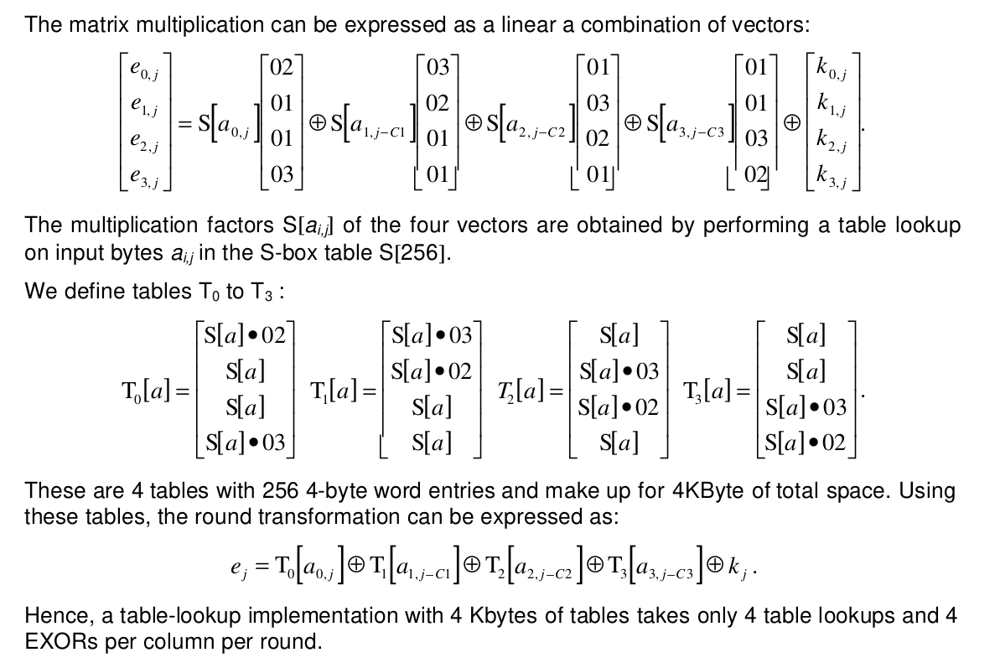

# AES Lookup Table Generation

This project implements the construction of AES lookup tables using Python. Lookup tables are precomputed values used in the AES algorithm to enhance performance during encryption and decryption operations. The methodology replicates the computations performed in cryptographic libraries like OpenSSL, ensuring compatibility and reliability.

## Table of Contents

- [Introduction](#introduction)
- [Project Structure](#project-structure)
- [Methodology](#methodology)
  - [Constructing the Lookup Tables](#constructing-the-lookup-tables)
  - [Using the Lookup Tables](#using-the-lookup-tables)
- [Importance of Lookup Tables](#importance-of-lookup-tables)
- [Usage](#usage)
- [License](#license)

## Introduction

The AES (Advanced Encryption Standard) algorithm uses substitution (S-box) and linear transformation (MDS matrix) operations to ensure strong cryptographic properties. This project focuses on precomputing the results of these operations into lookup tables to optimize runtime performance. The generated lookup tables are identical to those in the OpenSSL library, making this implementation suitable for integration into compatible cryptographic systems.

## Project Structure

- **Python Code**: Contains functions to generate and print lookup tables.
- **S-box**: A fixed substitution box used for byte substitution.
- **MDS Matrix**: A predefined matrix used for linear transformation.

## Methodology

### Constructing the Lookup Tables



We enter each possible value for the input plain text to the linear combination equation and construct the lookup table entries values.

**Example:** a = 0x00

**T<sub>0</sub> [0x00]**: <br>
    S[0x00] x 0x02 = 0x63 x 0x02 = 0xc6 <br>
    S[0x00] = 0x63 <br>
    S[0x00] = 0x63 <br>
    S[0x00] x 0x03 = 0xa5

Hence, T<sub>0</sub> [0x00] = 0xc66363a5

and so on for the rest of the values until 0xff, And by that we construct the first column of the state matrix.

For T<sub>1</sub>, T<sub>2</sub>, and T<sub>3</sub> we construct them in the same way and hence we construct the last 3 columns of the state matrix.

## How to extract the values from the lookup table

Let P be the input plain text, P = 0x00010203 04050607 08090A0B 0C0E0F00
We divide the input plain text to 4 groups, each group consists of 32-bit (4-bytes) and the are ordered in the following way in the state matrix:
[0x00 0x04 0x08 0x0C]
[0x01 0x05 0x09 0x0E]
[0x02 0x06 0x0A 0x0F]
[0x03 0x07 0x0B 0x00]

Then we apply then we work column by column, for each column,:
1st entry -> T<sub>0</sub>
2nd entry -> T<sub>1</sub>
3rd entry -> T<sub>2</sub>
4th entry -> T<sub>3</sub>

Let's do it for the first column: <br>
T<sub>0</sub> [0x00] = 0xc66363a5U, T<sub>1</sub> [0x01] = 0x84f87c7cU , T<sub>2</sub> [0x02] = 0x7799ee77U, T<sub>3</sub> [0x03] = 0x7b7b8df6U <br>
and so on for the rest of the tables. <br>

Let's do it for the second column: T<sub>0</sub> [0x04] = , T<sub>1</sub> [0x05] = , T<sub>2</sub> [0x06] = , T<sub>3</sub> [0x07] =  <br>

Let's do it for the third column: T<sub>0</sub> [0x08] = , T<sub>1</sub> [0x09] = , T<sub>2</sub> [0x0A] = , T<sub>3</sub> [0x0B] =  <br>

Let's do it for the fourth column: T<sub>0</sub> [0x0C] = , T<sub>1</sub> [0x0E] = , T<sub>2</sub> [0x0F] = , T<sub>3</sub> [0x00] = <br>

Then:
- e<sub>0</sub> = T<sub>0</sub> [0x00] ⊕ T<sub>1</sub> [0x01] ⊕ T<sub>2</sub> [0x02] ⊕ T<sub>3</sub> [0x03]

- e<sub>1</sub> = T<sub>0</sub> [0x04] ⊕ T<sub>1</sub> [0x05] ⊕ T<sub>2</sub> [0x06] ⊕ T<sub>3</sub> [0x07]

- e<sub>2</sub> = T<sub>0</sub> [0x08] ⊕ T<sub>1</sub> [0x09] ⊕ T<sub>2</sub> [0x0A] ⊕ T<sub>3</sub> [0x0B]

- e<sub>3</sub> = T<sub>0</sub> [0x0C] ⊕ T<sub>1</sub> [0x0E] ⊕ T<sub>2</sub> [0x0F] ⊕ T<sub>3</sub> [0x00]

## Importance of Lookup Tables

Lookup tables are critical in AES implementations due to their ability to:

1. **Enhance Performance**: By precomputing substitution and transformation results, runtime operations are reduced to simple table lookups.
2. **Ensure Compatibility**: The generated tables match those in the OpenSSL library, allowing seamless integration into widely used cryptographic systems.
3. **Optimize Security**: The precomputed values encapsulate complex GF(2^8) arithmetic, reducing the surface for side-channel attacks during runtime.

## Usage

1. Clone the repository:

   ```bash
   git clone https://github.com/Moh-Gebril/Generate-AES-Lookup-Tables.git
   cd Generate-AES-Lookup-Tables/src
   ```

2. Run the script to generate and display the lookup tables:

   ```bash
   python3 generate_aes_lookup_tables.py
   ```

3. Output tables will be printed in C-style array format for easy integration into other projects.

## License

This project is licensed under the MIT License. See the LICENSE file for details.
